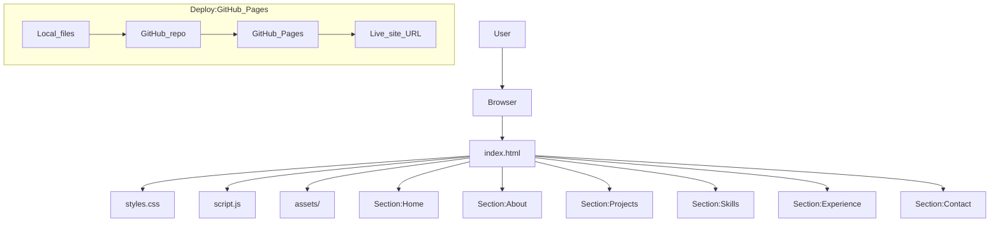

# Personal Website (Portfolio)

A clean, beginner-friendly personal portfolio site built with **HTML + CSS + JavaScript**.

## What’s included
- **Sections**: Home, About, Projects, Skills, Experience, Contact
- **Mobile-friendly navigation** (hamburger menu on small screens)
- **Modern styling** with one accent color
- **No framework required**

## Diagram (site + deploy flow)


## Run locally
You can open `index.html` directly in your browser, or use a simple local server (recommended).

### Option A: VS Code / Cursor Live Server
- Install the **Live Server** extension
- Right-click `index.html` → **Open with Live Server**

### Option B: Python (if installed)
```bash
python -m http.server 5500
```
Then open `http://localhost:5500`.

### Option C: Node.js (if installed)
```bash
npx serve .
```
Then open the URL it prints (usually `http://localhost:3000`).

## Customize (quick checklist)
- In `index.html`, replace:
  - **Your Name**
  - **email address**
  - **GitHub / LinkedIn links**
  - **projects** (titles, descriptions, links)
  - **skills** and **experience**
- Optional: add a real profile photo in `assets/` and replace the “Photo” area.

## Deploy for free with GitHub Pages
### Option A: Upload files (no Git required)
1. Create a GitHub repository (example: `personal-website`).
2. On the repo page, choose **Add file → Upload files**.
3. Upload: `index.html`, `styles.css`, `script.js`, `README.md`, and the `assets/` folder (if you added images).
4. Click **Commit changes**.
5. Go to **Settings → Pages**.
6. Under **Build and deployment**:
   - Source: **Deploy from a branch**
   - Branch: **main** / **(root)**
7. Save, then wait ~1 minute for the site to publish.

### Option B: Push with Git (recommended later)
1. Install Git (Windows): search “Git for Windows” and install it.
2. In your project folder, run:
```bash
git init
git add .
git commit -m "Initial portfolio site"
```
3. Create an empty GitHub repo, then add the remote and push (GitHub will show you the exact commands).
4. Enable GitHub Pages the same way as Option A.

## Next upgrades (optional)
- Add a real contact form using **Formspree** or **Netlify Forms**
- Add a dark mode toggle
- Add more projects and screenshots in `assets/`

